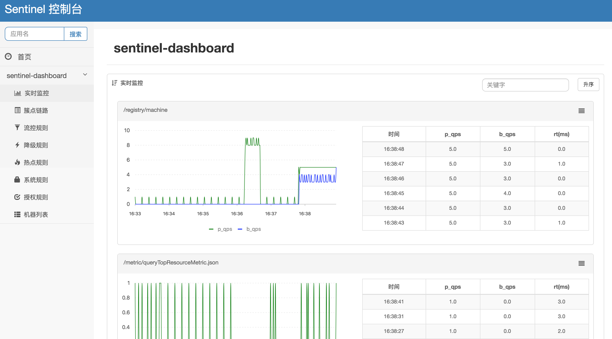
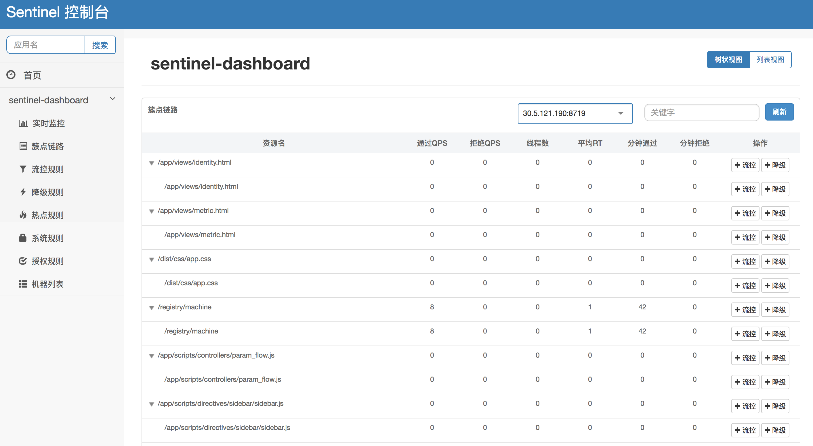

# Sentinel 1.3.0 重磅发布

[Sentinel](https://github.com/alibaba/Sentinel) 是阿里中间件团队开源的，面向分布式服务架构的轻量级流量控制框架，主要以流量为切入点，从流量控制、熔断降级、系统负载保护等多个维度来帮助用户保护服务的稳定性。

[Sentinel 1.3.0-GA 版本](https://github.com/alibaba/Sentinel/releases/tag/1.3.0)主要包括 Sentinel 控制台功能的完善和 bug 修复，以及其它的一些改进，是一个重要的生产可用版本。Sentinel 承接了阿里巴巴近 10 年的双十一大促流量的核心场景，完美地保障了阿里巴巴历年双十一的稳定性，因此从开源之初即具备生产可用的能力。Sentinel 开源三个月以来受到开源社区的广泛关注，目前已有多个企业用户在生产环境中使用，得到了用户的一致好评。

## Sentinel 时间简史

- 2012 年，Sentinel 诞生于阿里巴巴集团内部，主要功能为入口流量控制。
- 2013 - 2018 年，Sentinel 在阿里巴巴集团内部迅速发展，成为基础技术模块，覆盖了所有的核心场景。Sentinel 也因此积累了大量的流量控制场景以及生产实践。
- 2018 年 7 月，Sentinel 正式开源，首个版本（0.1.0）即生产可用。
- 2018 年 9 月，Sentinel 的重要里程碑版本 0.2.0 发布，带来多项全新特性，同时已有外部企业用户在生产环境中使用。
- 2018 年 10 月，Sentinel 进入 CNCF Landscape；Sentinel 的里程碑版本 1.3.0-GA 发布，重要的生产可用版本。

## Sentinel 开源生态

Sentinel 的开源生态非常广泛。Sentinel 针对常用的框架和库进行了适配，包括 **Web Servlet、Dubbo、Spring Cloud、gRPC** 等，用户只需引入相应依赖并进行简单配置即可**快速接入** Sentinel。同时，Sentinel 动态规则源针对常见的配置中心和远程存储进行适配，目前已支持 **Nacos、ZooKeeper、Apollo、Redis** 等多种动态规则源，可以覆盖到很多的生产场景。未来，Sentinel 还会对更多常用框架和配置中心进行适配，覆盖更广泛的场景。

 

在下个版本的集群限流功能发布后，Sentinel 还会为 **API Gateway**（如 Netflix Zuul）和 **Service Mesh**（如 Istio）提供全局流量控制的能力。

那么 Sentinel 作为生产可用的流量控制框架，都有哪些吸引人的特性呢？

## 特性介绍

### 轻量级

Sentinel 提供完善的适配模块。对 Dubbo 服务、Spring Cloud 服务来说，用户只需引入对应依赖并进行简单配置即可，不需要修改现有业务代码，可以非常简单、快速地接入。

Sentinel 作为一个功能完备的高可用流量控制框架，其核心 `sentinel-core` **没有任何多余依赖**，打包后只有 200 KB，非常轻量级。用户可以放心地引入 `sentinel-core` 而不需担心依赖问题。同时，引入 Sentinel 带来的**性能损耗非常小**。单机 QPS 不太大的时候损耗几乎可以忽略不计（单机 4.3W QPS 的损耗约为 2.36%），因此用户无需担心 Sentinel 会给线上业务带来性能问题。

 

### 易用的控制台

Sentinel 控制台提供强大的**实时监控**和**规则配置管理**能力，用户可以非常方便地：

- 直观地查看不同应用、不同资源的实时监控数据

 

- 查看当前的资源调用链路以及实时的调用数据

 

- 配置流控规则、降级规则、系统保护规则、热点规则、授权规则

 

若用户在生产环境中使用了动态规则源，只需对控制台进行少量的改造即可在生产环境中使用 Sentinel 控制台，可以参考 [在生产环境中使用 Sentinel 控制台](./use-sentinel-dashboard-in-production.md) 一文。

### 专业的流量控制

Sentinel 提供多个方面的专业流控能力来保障服务的稳定性：

- [多维度的流量控制](https://github.com/alibaba/Sentinel/wiki/%E6%B5%81%E9%87%8F%E6%8E%A7%E5%88%B6)：流量是实时的、不确定的，因此我们需要对实时到来的不规则的流量进行一定的控制。Sentinel 从**资源粒度**、**运行的指标**、**资源的调用关系**、**控制效果**等多个维度提供流量控制的能力；
- [服务的熔断降级](https://github.com/alibaba/Sentinel/wiki/%E7%86%94%E6%96%AD%E9%99%8D%E7%BA%A7)：Sentinel 从多个方面提供对不稳定服务降级的能力，可以及时熔断不稳定的服务（如响应时间非常长的服务），防止拖垮下游服务造成级联错误；
- [全局维度的系统保护](https://github.com/alibaba/Sentinel/wiki/%E7%B3%BB%E7%BB%9F%E8%B4%9F%E8%BD%BD%E4%BF%9D%E6%8A%A4)：Sentinel 从全局的维度对系统负载进行保护，让系统的入口流量和系统的负载达到一个平衡，**保证系统在能力范围之内处理最多的请求**；
- [黑白名单控制](https://github.com/alibaba/Sentinel/wiki/%E9%BB%91%E7%99%BD%E5%90%8D%E5%8D%95%E6%8E%A7%E5%88%B6)：根据资源的调用方来决定资源请求是否通过；
- [热点参数限流](https://github.com/alibaba/Sentinel/wiki/%E7%83%AD%E7%82%B9%E5%8F%82%E6%95%B0%E9%99%90%E6%B5%81)：对热点数据的访问进行限制，参数粒度的流量控制；

## 可扩展性

Sentinel 提供多样化的 SPI 接口用于提供扩展的能力。用户可以在用同一个 `sentinel-core` 的基础上自行扩展接口实现，从而可以方便地根据业务需求给 Sentinel 添加自定义的逻辑。目前 Sentinel 提供如下的扩展点：

- 初始化过程扩展：可以添加自定义的一些初始化逻辑，如动态规则源注册等
- Slot Chain 扩展：用于给 Sentinel 功能链添加自定义的功能并自由编排
- 指标统计扩展（StatisticSlot Callback）：用于扩展 StatisticSlot 指标统计相关的逻辑
- Transport 扩展：用于对心跳发送、监控 API Server 进行扩展

## 总结

Sentinel 在阿里巴巴集团内部经过了多年双十一的历练，在外部也已有多个企业用户在生产环境使用，可以说是完全具备生产可用的能力。欢迎大家在自己的生产环境中使用 Sentinel，有反馈或者建议欢迎在 GitHub 上提 issue；若您已在生产环境使用，也欢迎到 [GitHub](https://github.com/alibaba/Sentinel/issues/18) 上面登记一下；也欢迎大家多参与到 Sentinel 社区中来，一起为 Sentinel 的开源演进做出贡献。