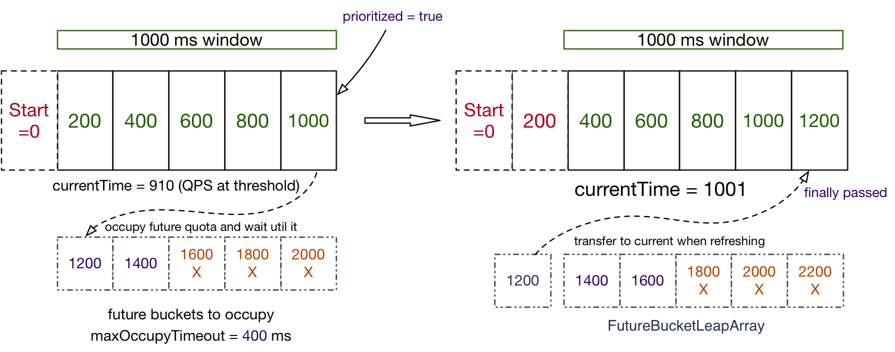
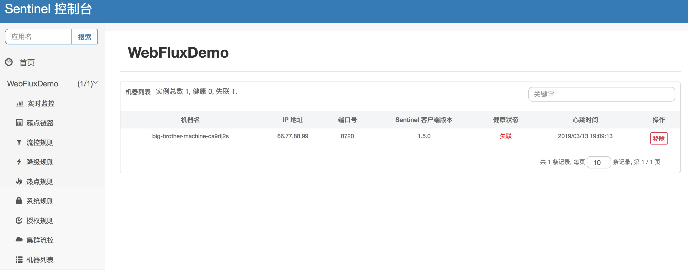

# Sentinel 1.5.0 版本发布，引入 Reactive 支持

流控降级组件 Sentinel 的又一个里程碑版本 1.5.0 正式发布，引入了 reactive 的支持，并提供多项新特性与改进。从 1.5.0 版本开始，Sentinel 仅支持 JDK 1.7 及以上版本，不再支持 JDK 1.6。现在我们可以利用 Java 7 的 try-with-resources 特性来更为简洁地使用 Sentinel API：

```java
// 1.5.0 版本开始可以利用 try-with-resources 特性，自动 exit
try (Entry entry = SphU.entry("resourceName")) {
  // 被保护的业务逻辑
} catch (BlockException ex) {
  // 资源访问阻止，被限流或被降级，在此处进行相应的处理操作
}
```

下面我们来一起探索一下 Sentinel 1.5.0 的新特性。

## Reactor 适配

Reactive 的事件驱动设计理念、流式函数式 API 使得开发者可以更优雅地设计和编写程序，并且在一些场景下可以提升应用的吞吐量。越来越多的人开始用 RxJava 和 Reactor，Java 9 也将 Reactive Streams 的接口引入了 JDK，Spring 5.0 也引入了 Spring WebFlux / Project Reactor。可以说 reactive 是 Java 社区未来的一个发展趋势。

Sentinel 1.5.0 引入了 Reactor 适配模块 `sentinel-reactor-adapter`，从而具备了与 Spring WebFlux、Spring Cloud Gateway 等 reactive 框架的整合能力，应用范围更加广泛。

Sentinel Reactor 适配分别针对 `Mono` 和 `Flux` 实现了对应的 Sentinel Operator，从而在各种事件触发时汇入 Sentinel 的相关逻辑。同时 Sentinel 在上层提供了 `SentinelReactorTransformer` 用于在组装期装入对应的 operator，用户使用时只需要通过 `transform` 操作符来进行变换即可：

```java
someService.doSomething() // return type: Mono<T> or Flux<T>
   .transform(new SentinelReactorTransformer<>(resourceName)) // 在此处进行变换
   .subscribe();
```

## Spring WebFlux 适配

Spring 从 5.0 开始引入了响应式的 Web 框架 —— Spring WebFlux，并且 Spring Boot 2.0 版本开始也支持 Spring WebFlux。Spring WebFlux 顶层基于 Reactor 抽象出了一套 reactive 的接口和适配器，底层可以基于 Netty、异步 Servlet 等实现 Web Server。与传统 Servlet 容器相比，Spring WebFlux 在很多 I/O 密集型的场景下可以提升应用的吞吐量，因此越来越多的用户开始使用 Spring WebFlux。

Sentinel 1.5.0 提供与 Spring WebFlux 的整合模块 `sentinel-spring-webflux-adapter`，从而 Reactive Web 应用也可以利用 Sentinel 的流控降级来保障稳定性。该整合模块基于 Sentinel Reactor Adapter 实现。

在使用 sentinel-spring-webflux-adapter 的时候，我们只需要引入相应依赖，然后引入对应的配置即可生效：

```java
@Configuration
public class WebFluxConfig {

    private final List<ViewResolver> viewResolvers;
    private final ServerCodecConfigurer serverCodecConfigurer;

    public WebFluxConfig(ObjectProvider<List<ViewResolver>> viewResolversProvider,
                         ServerCodecConfigurer serverCodecConfigurer) {
        this.viewResolvers = viewResolversProvider.getIfAvailable(Collections::emptyList);
        this.serverCodecConfigurer = serverCodecConfigurer;
    }

    @Bean
    @Order(-1)
    public SentinelBlockExceptionHandler sentinelBlockExceptionHandler() {
        // 注册 SentinelBlockExceptionHandler 处理流控降级异常
        return new SentinelBlockExceptionHandler(viewResolvers, serverCodecConfigurer);
    }

    @Bean
    @Order(-1)
    public SentinelWebFluxFilter sentinelWebFluxFilter() {
        // 注册 SentinelWebFluxFilter
        return new SentinelWebFluxFilter();
    }
}
```

Spring Cloud Alibaba Sentinel 未来也会支持 Spring WebFlux 的自动配置，无需编写配置类，引入对应依赖即可生效。

## 滑动窗口统计结构的改进

Sentinel 1.5.0 对底层的滑动窗口统计结构进行了升级，添加了“占用”机制，允许在当前 QPS 已经达到限流阈值时，同个资源高优先级的请求提前占用未来时间窗口的配额数，等待到对应时间窗口到达时直接通过，从而可以实现“最终通过”的效果而不是被立即拒绝；而同个资源低优先级的请求则不能占用未来的配额，阈值达到时就会被限流。

Sentinel 1.5.0 引入了 `FutureBucketLeapArray`，这是一种特殊的滑动窗口，仅维持当前时间以后的格子，从而可以用于统计未来被预先占用的配额数目。Sentinel 将普通的滑动窗口与 `FutureBucketLeapArray` 组合成可占用的滑动窗口 `OccupiableBucketLeapArray`，从而实现了“部分高优先级请求最终通过”的效果。我们可以调用 `SphU.entryWithPriority(resourceName)` 来标识本次调用为高优先级（prioritized = true）。



## 控制台支持剔除离线机器和应用

从 1.5.0 版本开始，Sentinel 控制台支持移除离线的机器和应用。用户可以在“机器列表”页面手动剔除离线的机器实例，或者配置自动移除离线的机器和应用。支持的配置项：

- 机器失联判定的超时时间（默认 1 分钟）
- 当机器失联超过一定时长，是否自动删除失联节点
- 当应用所有机器全部失联，并且最近心跳时间超出指定时长，自动在页面隐藏或后台剔除该应用

 

感谢社区用户 @jasonjoo2010 对该功能的贡献。

## 其它

除了上面的重要特性之外，Sentinel 1.5.0 还带来了以下的特性和改进：

- 系统自适应限流支持 CPU usage 指标。
- transport 模块引入 ApiCommandHandler，用户可以通过此命令查看所有可用的 API 以及相应描述。
- Sentinel 控制台增加权限控制接口，用户可以自行扩展实现权限控制的需求。

详细信息请参考 [Release Notes](https://github.com/alibaba/Sentinel/wiki/Release-Notes#150)，欢迎大家使用并提出建议。
