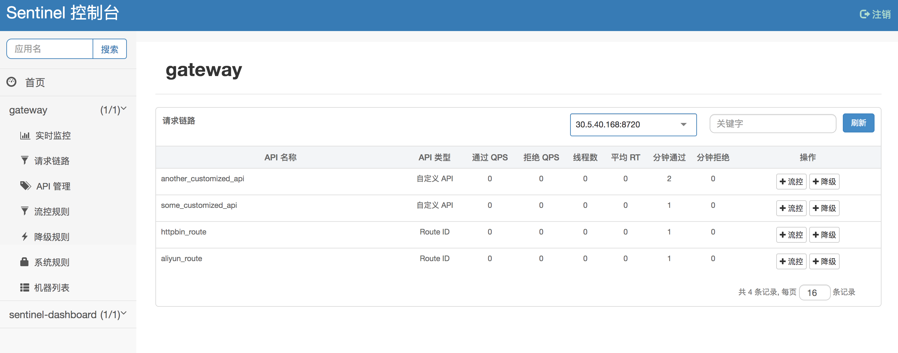
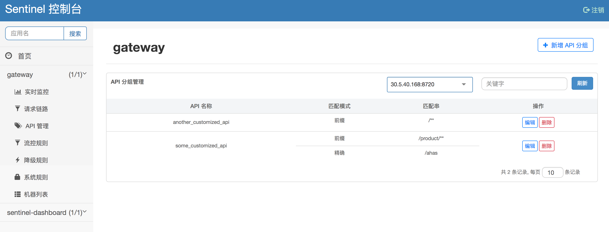
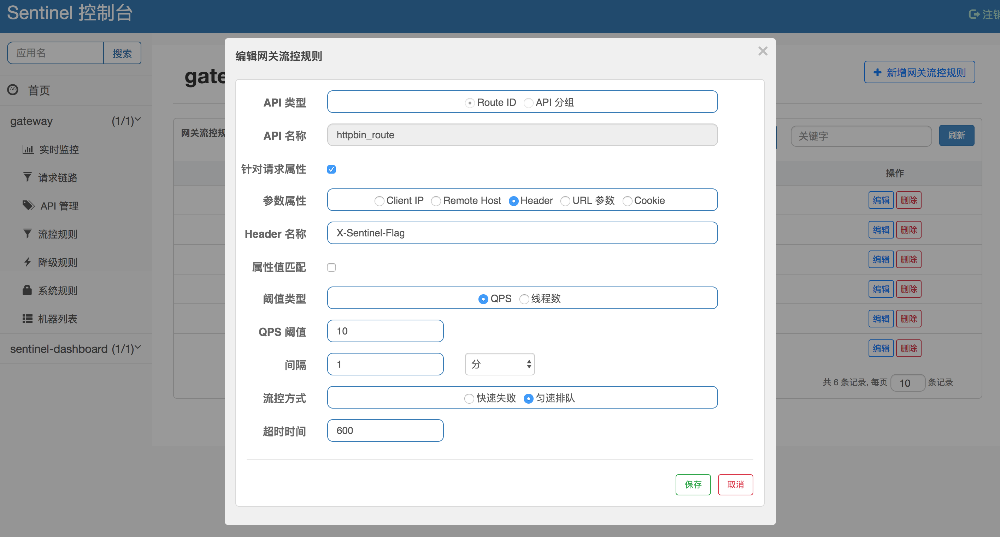

# Sentinel 1.6.3 版本发布，引入网关流控控制台支持

流控降级组件 [Sentinel 1.6.3](https://github.com/alibaba/Sentinel/releases/tag/1.6.3) 正式发布，引入了网关流控控制台的支持，同时带来一些 bug 修复和功能改进。

## 网关流控控制台

<div style="text-align: center;">

</div>

Sentinel 网关流控支持针对不同的路由和自定义的 API 分组进行流控，支持针对请求属性（如 URL 参数，Client IP，Header 等）进行流控。Sentinel 1.6.3 引入了网关流控控制台的支持，用户可以直接在 Sentinel 控制台上查看 API Gateway 实时的 route 和自定义 API 分组监控，管理网关规则和 API 分组配置。

在 API Gateway 端，用户只需要在[原有启动参数](https://github.com/alibaba/Sentinel/wiki/控制台#32-配置启动参数)的基础上添加如下启动参数即可标记应用为 API Gateway 类型：

```bash
-Dcsp.sentinel.app.type=1
```

添加正确的启动参数后，我们就可以在 Sentinel 上面看到对应的 API Gateway 了。我们可以查看实时的 route 和自定义 API 分组的监控和调用信息：



我们可以在控制台配置自定义的 API 分组，将一些 URL 匹配模式归为一个 API 分组：



然后我们可以在控制台针对预设的 route ID 或自定义的 API 分组配置网关流控规则：



感谢 Committer @cdfive 的贡献。更多网关流控的特性可以参考 [Sentinel 网关流控文档](https://github.com/alibaba/Sentinel/wiki/网关限流)。

## 其它改进

- 控制台支持配置 CPU 使用率模式的系统保护规则
- Web Servlet CommonFilter 支持通过 UrlCleaner 来过滤不需要的 URL 模式
- Spring Cloud Gateway filter 支持配置 order，以解决 Spring Cloud Gateway `@Order` 注解不生效的 bug

详细信息请参考 [Release Notes](https://github.com/alibaba/Sentinel/wiki/Release-Notes#163)，欢迎大家使用并提出建议，也欢迎大家一起参与贡献。
