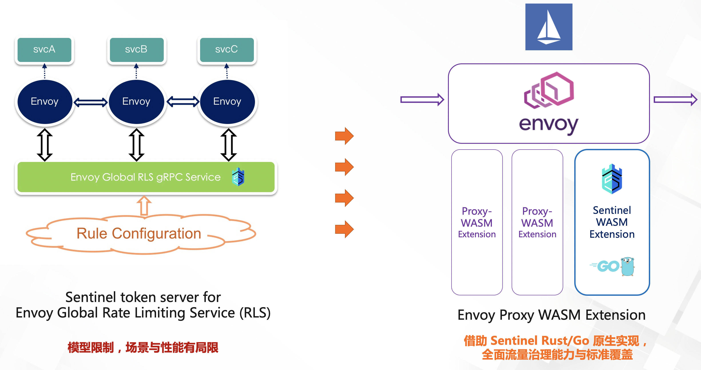
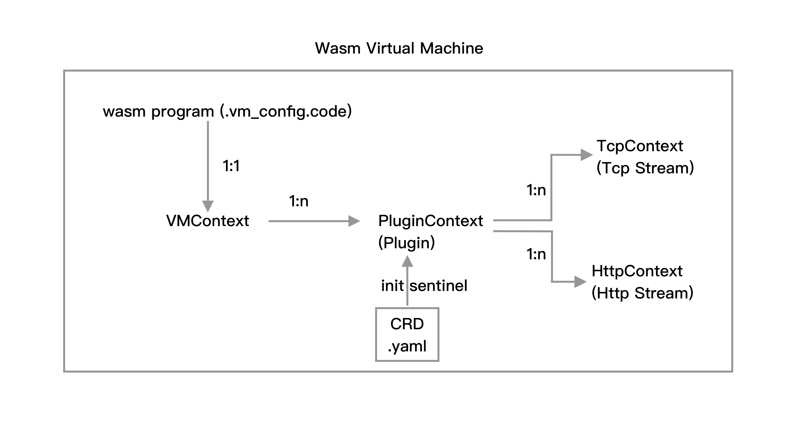
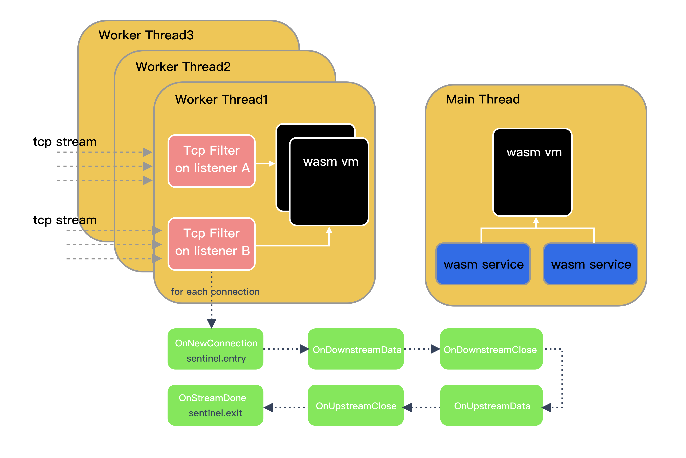

# Sentinel envoy wasm 插件设计思路

# 项目背景

由于 sentinel token server for Envoy Global Rate Limiting Service 模型的限制，场景和性能有局限，加上云原生近几年的高速发展，sentinel wasm extension 在社区中的呼声越来越高。利用 Envoy wasm extension，借助 sentinel go 原生的实现，可以实现全面的流量治理能力与标准覆盖。

# 涉及工具

- tinygo 0.24.0 linux/amd64 (using go version go1.18.4 and LLVM version 14.0.0)
- func-e 1.1.3
- kubernetes/kubectl
- Istio
- Envoy

# 架构设计

本次实现的 sentinel wasm extension 是基于 sentinel-go 的版本。所以要用到 proxy-wasm-go-sdk。这个 repo 对 Proxy-Wasm ABI 的一封封装，提供了一系列 Go 语言的 API。使用这个 SDK，可以生成与 Proxy-Wasm 规范兼容的 Wasm 二进制文件。

在讨论 wasm 架构设计之前，要写谈谈 Wasm 虚拟机 (Wasm VM) 。Wasm VM 是加载插件的载体。在 Envoy 中，在每个线程中创建 VM 并且 VM 之间相互隔离。因此，我们创建的程序将被复制到 Envoy 创建的线程中，并加载到每个 VM 上。 Proxy-Wasm 规范中允许在单个 VM 中拥有多个插件。换句话说，一个 VM 可以被多个插件共同使用。

考虑到 sentinel 未来不仅要支持 http filter，有可能还要支持 grpc 的 filter，所以这次 wasm 插件的设计思路是基于 L4 tcp 来实现的。阅读 wasm 的文档，我们可以知道，tcp 层可以做的操作有：tcp 数据帧相关操作、建立连接，断开链接，上行数据处理，下行数据处理。

> 值得提的是，还有一种特性是，Wasm Service 是一种在单例 VM 中运行的插件（即 Envoy 主线程中仅存在一个实例）。它主要用于 filter 并行执行一些额外的工作，例如聚合指标、日志等。有时，这样的单例 VM 本身也称为 Wasm 服务。sentinel 如果有聚合指标的操作，可以借助 Wasm Service 来完成。
> 

从 vm 加载时机来看，线程先加载 vm，然后 vm 创建 context，然后加载 plugin context。sentinel 插件被 vm 加载，在这个时候，可以加载咱们指定的一些 rule CRD 规范 yaml 文件，进行 sentinel 初始化操作。sentinel plugin 初始操作完成以后，便开始监听 tcp connection 了。

针对每一个 tcp connection，插件会拦击每一个上行数据包和下行数据包，这个时候存在 5 个 hook 可以执行。在 OnNewConnection 的时候初始化 entry，开启 go 的统计协程。在 OnStreamDone 的时候调用 exit 函数，并输出 BlockError 错误信息。

如果中间出现限流，熔断等操作，在 OnUpstreamData 中拿到 BlockError，并返回这个错误信息给 client。每个 connection 都会触发 entry，如果是正常退出，则会触发 exit，如果是被限流，则返回 BlockError。

## 额外的一些思考

既然每个线程创建了 vm，每个 vm 上有创建了 plugin。那么每个种类的 filter 不一定都要创建在一个 vm 上，可以按照种类不同，创建在多个 vm 上。因为有可能 vm 可承受的 tcp connection 存在一个上限。分散到多个 vm 上，这样可以支持更大的吞吐量。上述只是我的一个猜想，具体行为还需要在生产环境中测试才能确定是否要分 vm。如果分 vm，跨 vm 之间的数据同步和通信是可以实现的。

# 具体代码实现

代码见 [main.go](https://github.com/halfrost/sentinel-go-envoy-proxy-wasm/blob/sentinel-go/main.go)

# 待解决的问题

## 1. tinygo 存在限制

鉴于 tinygo 的限制，不能完美支持 cgo。这意味着我不能使用 etcd 和 prometheus 相关功能。因为它们俩会依赖 xxhash。xxhash 需要 cgo 编译。于是我注释掉 etcd 和 prometheus 以及它们关联的依赖。注掉以后，再编译确实可以通过。但是 sentinel 会出 bug。调试以后发现，在 exporter/metric/prometheus/exporter.go:20:2 这一行中，如果没有 prometheus client 依赖包，metric 是 0，这会导致 sentinel 底层统计计数一部分为 0，这会直接导致 sentinel 永远不会触发流控逻辑。我这两天一直在折腾这部分，还是没调试出来。如果有 sentinel-golang 开发同学，我很想问问他，如果移除 prometheus，有什么办法能 workaround。这部分我暂时想不到其他方法可以绕开。

在 wasm plugin 中，常见的统计计数都很容易实现，但是涉及到 prometheus 中一些底层的 metric，目前会受到 tinygo 的限制，导致编译错误。我在 Stack Overflow，github 上也寻找过解决方案，看了一些比较复杂的 wasm plugin，tinygo 的版本还没有人写出来和 prometheus 有关的功能。关于 cgo 的问题，已经提 issue 给 tinygo 团队了。他们目前正在修复中，issue 在这里：[https://github.com/tinygo-org/tinygo/issues/3044](https://github.com/tinygo-org/tinygo/issues/3044)

## 2. reflect 的问题

除去 cgo 的问题，还有一些关于 reflect 的问题。可能你会好奇，哪里会用到 reflect？其实在读取 yaml 文件的时候就会用到。在 yaml 文件中用 map 传递一些值给 plugin，比如 resource name，crd path。这些是包在一个 json 中。tinygo 解析的时候，并不知道里面有哪些字段，它会以 interface{} 类型去解析。这就会用到 reflect 了。在现在的实现代码中写了读取 crd yaml 的代码了。但是实际运行会崩溃。错误和这个 issue 是一样的：[https://github.com/tinygo-org/tinygo/issues/2660](https://github.com/tinygo-org/tinygo/issues/2660)。这个问题有 workaround 的方法，即传值不要传递一个可变结构的 map。这样 tinygo 解析的时候不会用 interface 去序列化，也不会触发这个 reflect 的 bug。但是这个 bug 真的很常见。如果传一个 json 数据，就 panic 了。json 是一个可变结构的 map。

# 当前进度

基于上述的一些原因。我还没有完整的把 sentinel wasm 跑起来。因为目前涉及到 prometheus，暂时还没想到 workaround 方法。我目前测试的 case 是，把我写好的 wasm 放到 envoy 上运行。然后在这台机器上 curl 对应的接口。触发 wasm tcp filter，进而可以测试 tcp filter 的逻辑。我觉得重头还是测试 sentinel 在 wasm plugin 上的逻辑。

