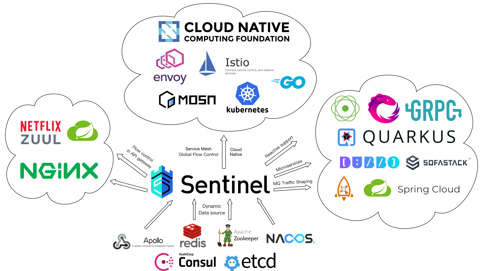

# 中科院开源软件供应链点亮计划 2021 Sentinel 项目招募

[开源软件供应链点亮计划 - 暑期 2021](https://summer.iscas.ac.cn/#/homepage)（以下简称 暑期 2021）是由 中国科学院软件研究所 与 openEuler 社区 共同举办的一项面向高校学生的暑期活动，旨在鼓励在校学生积极参与开源软件的开发维护，促进优秀开源软件社区的蓬勃发展。该活动将联合各大开源社区，针对重要开源软件的开发与维护提供项目，并向全球高校学生开放报名。

学生可自主选择感兴趣的项目进行申请，并在中选后获得该软件资深维护者（社区导师）亲自指导的机会。根据项目的难易程度和完成情况，参与者还将获取 开源软件供应链点亮计划-暑期2021 活动奖杯和奖金。详情请参考 [学生指南](https://summer.iscas.ac.cn/help/student/)。

[Sentinel](https://github.com/alibaba/Sentinel) 是阿里巴巴开源的，面向云原生、分布式服务架构的高可用防护组件，主要以流量为切入点，从限流、流量整形、熔断降级、系统自适应保护、热点防护等多个维度来帮助开发者保障微服务的稳定性。Sentinel 承接了阿里巴巴近 10 年的双十一大促流量的核心场景，例如秒杀、冷启动、消息削峰填谷、集群流量控制、实时熔断下游不可用服务、系统自适应保护等，是保障微服务高可用的利器，原生支持 Java/Go/C++ 等多种语言，并且提供 Istio/Envoy 全局流控支持来为 Service Mesh 提供高可用防护的能力。

- Sentinel: https://github.com/alibaba/Sentinel
- Sentinel Go: https://github.com/alibaba/sentinel-golang

Sentinel 将作为指导组织参与编程之夏 2021。Sentinel 社区选取[一些有挑战性的议题](https://github.com/alibaba/Sentinel/issues/2228)，期待各位在校同学一起参与贡献，共同主导阿里双十一背后高可用防护组件的演进。Sentinel 的选题覆盖云原生、高可用、分布式系统、多语言等领域，欢迎感兴趣的同学报名咨询。

[编程之夏 Sentinel 项目报名请移至此处](https://summer.iscas.ac.cn/#/org/orgdetail/sentinel)

以下是 Sentinel 社区的项目 idea 介绍。

## Idea List

### Sentinel 多语言版本（Node.js）

本项目期望为 Sentinel 新增 Node.js 语言原生实现。多语言版本期望包括基础的监控统计、流控、熔断降级、系统保护、热点参数流控等特性，并需要适配 Node.js 多进程模型（即单机流控要汇总进程的统计而不是仅单进程流控）。

难度：Intermediate

[报名地址点击此处](https://summer.iscas.ac.cn/#/org/prodetail/210660638)

### Sentinel 多语言版本（Rust）

本项目期望为 Sentinel 新增 Rust 语言原生实现。多语言版本期望包括基础的监控统计、流控、熔断降级、系统保护、热点参数流控等特性。同学需要有一定的 Rust 编程经验，同时对 Sentinel 有一定的了解。

难度：Hard

[报名地址点击此处](https://summer.iscas.ac.cn/#/org/prodetail/210660637)

### Sentinel 2.0 高可用决策中心组件

当前 Sentinel 正在朝着 2.0 云原生智能化的方向演进，其中一个重要的部分就是 云原生高可用决策中心组件 (Cluster Policy Brain)。Cluster Policy Brain 设计可以针对任意流量稳定性的场景做一些控制的策略，这里面包括但不限于：集群流控、全局自适应流控/调度、访问控制、流量清洗、服务权重调整/调度等。 Cluster Policy Brain 期望基于 Sentinel Go 实现，作为弱中心化、弱依赖的云原生组件部署。Sentinel 2.0 SDK 配合 brain 来做实例级别和集群级别的策略控制，其中一些策略控制（如 1.x 里面的单机流控、熔断）等还是在 SDK 侧进行判断，但是策略由 brain 自动生成（或经传统 rule CRD 手动配置）。Cluster Policy Brain 需要贴近云原生生态，支持声明式的配置，同时提供统一的标准接口对外透出 endpoint 提供服务。

难度：Intermediate/Hard

[报名地址点击此处](https://summer.iscas.ac.cn/#/org/prodetail/210660636)

### Sentinel Envoy 流控插件 (Envoy WASM)

Sentinel Java 1.7.0 版本开始利用 Sentinel 集群流控 token server 适配 Envoy Global rate limiting service (RLS) 标准接口来提供对 Envoy/Istio 服务网格的全局流控支持。本项目期望利用 Envoy WASM 扩展能力，结合 Sentinel Java/Go 版本，实现 Envoy 流控插件，可以支持现有 Sentinel 的所有能力，并确保 Sentinel 自身性能损耗不会很大。

难度：Intermediate

### Circuit breaking and fail-over for unhealthy clusters

通过适配模块、字节码增强等方式在服务发现和负载均衡模块中集成 Sentinel 高可用防护的能力，从而可以为 Spring Cloud/Dubbo 等提供节点/集群维度的熔断和 failover 的能力。

难度：Intermediate

[报名地址点击此处](https://summer.iscas.ac.cn/#/org/prodetail/210660639)

## 参考资料

- [Sentinel 官方网站](https://sentinelguard.io/zh-cn/)
- [Awesome Sentinel (社区贡献的一些文章)](https://github.com/sentinel-group/sentinel-awesome)
- [Sentinel 开源贡献指南，可以参考这里来入门社区贡献](https://github.com/alibaba/Sentinel/issues/391)