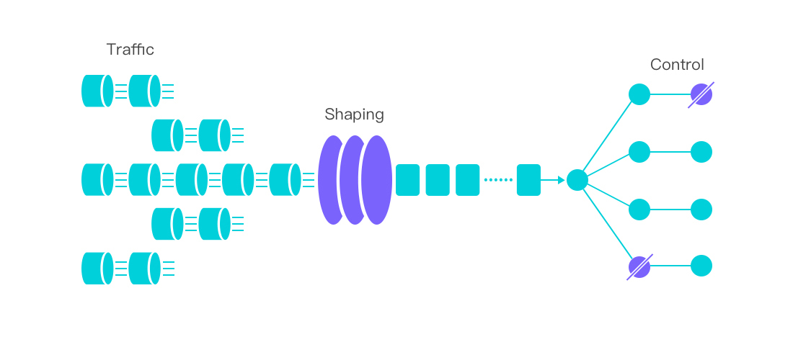

# Introduction

# What Is Sentinel?

As distributed systems are becoming increasingly popular, the reliability between services is becoming more important than ever before. Sentinel is a powerful flow control component that takes "flow" as the breakthrough point and covers multiple fields including flow control, concurrency limiting, circuit breaking, and adaptive system protection to guarantee the reliability of microservices.

## History of Sentinel

* 2012, Sentinel was born in Alibaba with the main purpose of flow control.
* 2013-2017, Sentinel grew fast and became a fundamental component for all microservices in Alibaba. It was used in more than 6000 applications and covers almost all core e-commerce scenarios. 
* 2018, Sentinel evolves into an open-source project.
* 2020, [Sentinel Go](https://github.com/alibaba/sentinel-golang) released.
* 2021, [Sentinel Rust](https://github.com/sentinel-group/sentinel-rust) released. And we've brought cool features like Envoy WASM extension and eBPF extension with Sentinel.

# Key Concepts

## Resource

**Resource** is a key concept in Sentinel. It could be anything, such as a service, a method, or even a code snippet.

Once it is wrapped by Sentinel API, it is defined as a resource and can apply for protections provided by Sentinel.

## Rules

The way Sentinel protects resources is defined by rules, such as flow control, concurrency limiting, and circuit breaking rules. Rules can be dynamically changed, and take effect in real-time.

# Features and Principles

## Flow Control

Sentinel provides the ability to handle random incoming requests according to the appropriate shape as needed, as illustrated below:

## Principles of Flow Control

Flow control is based on the following statistics:

* Invocation chain between resources;
* Runtime metrics such as QPS, response time and system load;
* Desired actions to take, such as reject immediately or queueing.

Sentinel allows applications to combine all these statistics in a flexible manner. 

## Circuit Breaking and Concurrency

Circuit breaking is used to detect failures and encapsulates the logic of preventing failure from constantly reoccurring during maintenance, temporary external system failure or unexpected system difficulties. 

To tackle this problem, [Hystrix](https://github.com/Netflix/Hystrix/wiki#what-problem-does-hystrix-solve) chose to use threads and thread-pools to achieve isolation. The main benefit of thread pools is that the isolation is thorough, but it could bring extra overheads and leads to problems in scenarios related to `ThreadLocal` (e.g. Spring transactions).

Sentinel uses the following principles to implement circuit breaking:

### Max concurrency limiting

Instead of using thread pools, Sentinel reduces the impact of unstable resources by restricting the number of concurrent threads (i.e. semaphore isolation).

When the response time of a resource becomes longer, threads will start to be occupied. When the number of threads accumulates to a certain amount, new incoming requests will be rejected. Vice versa, when the resource restores and becomes stable, the occupied thread will be released as well, and new requests will be accepted. 

By restricting concurrent threads instead of thread pools, you no longer need to pre-allocate the size of the thread pools and can thus avoid the computational overhead such as the queueing, scheduling, and context switching.

### Circuit breaking

Besides restricting the concurrency, downgrade unstable resources according to their response time is also an effective way to guarantee reliability. When the response time of a resource is too large, all access to the resource will be rejected in the specified time window.

## Adaptive System Protection

Sentinel can be used to protect your server in case the system load or CPU usage goes too high. It helps you achieve a good balance between system load and incoming requests and the system can be restored very quickly.

# How Sentinel works

# Ecosystem Landscape

