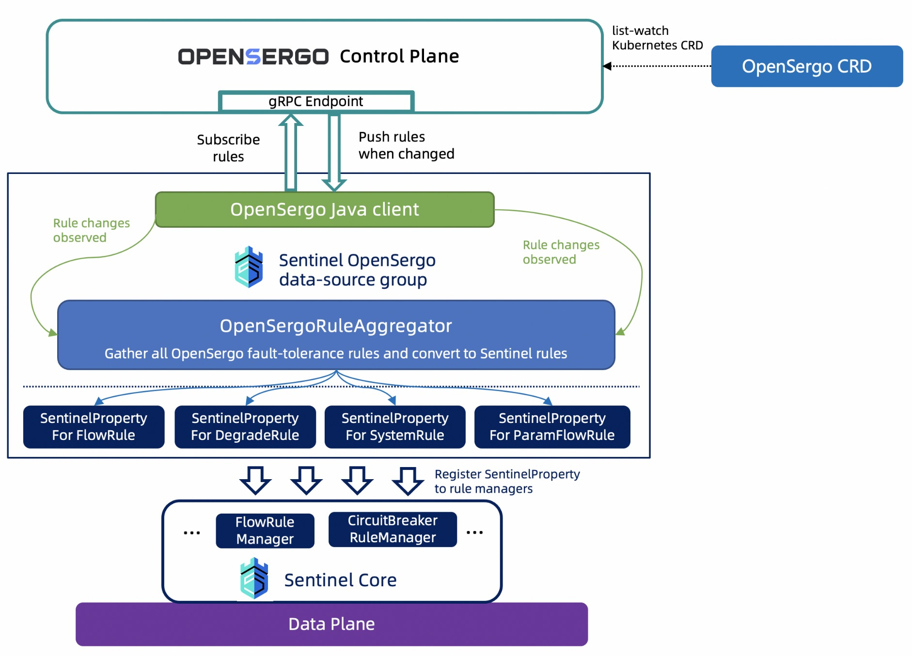

# OpenSergo Specification Support

[Sentinel OpenSergo data-source](https://github.com/alibaba/Sentinel/tree/master/sentinel-extension/sentinel-datasource-opensergo) provides integration with [OpenSergo](https://opensergo.io/). The data source leverages [OpenSergo Java SDK](https://github.com/opensergo/opensergo-java-sdk) to implement subscribe (push) model.

## Usage

To use Sentinel OpenSergo data-source, you'll need to add the following Maven dependency:

```xml
<dependency>
    <groupId>com.alibaba.csp</groupId>
    <artifactId>sentinel-datasource-opensergo</artifactId>
    <version>x.y.z</version>
</dependency>
```



Then you can create an `OpenSergoDataSourceGroup` and subscribe Sentinel rules. For example:

```java
OpenSergoDataSourceGroup openSergo = new OpenSergoDataSourceGroup(host, port, namespace, appName);
openSergo.start();

// Subscribe flow rules from OpenSergo control plane, and propagate to Sentinel rule manager.
FlowRuleManager.register2Property(openSergo.subscribeFlowRules());
```

Be sure to have [OpenSergo Control Plane](https://opensergo.io/docs/quick-start/opensergo-control-plane/) installed in your Kubernetes cluster.