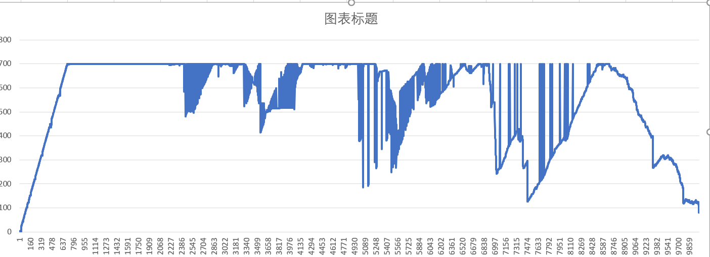
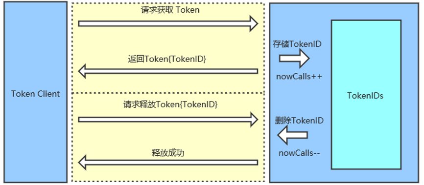
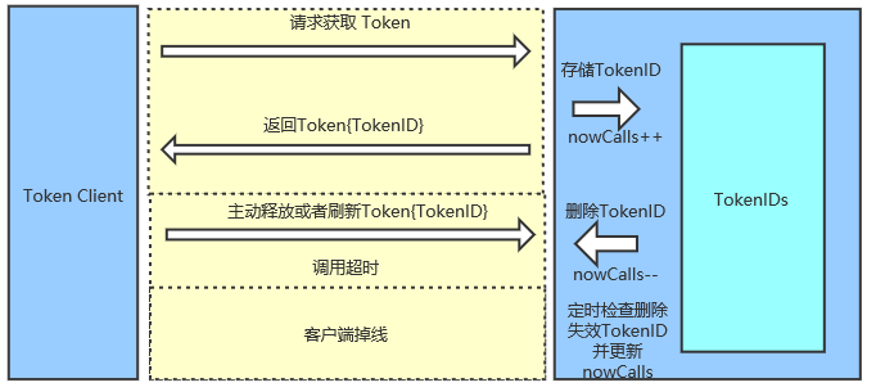

# 集群并发控制

## 概述

在某些场景下我们需要控制一个资源在某个时刻被同时占用的数目，即并发数。我们已经实现了本地并发控制，可见[Thread数限流](./flow-control.md)。
现在我们新增了集群并发控制的新特性，集群并发控制的基本框架可见[集群并发控制](./cluster-flow-control.md),此处不再赘述。
集群并发控制的实现主要基于token即令牌的分发与回收机制实现。理论的流控效果如下，我们的可以控制并发数为700，横轴为请求顺序，纵轴为当前并发数：



每个资源的最大并发量可以用符号concurrencyLevel表示，把当前执行数量nowCalls和concurrencyLevel 作比较，
似乎只需要保证nowCalls小于等于concurrencyLevel就行了，不需要存储额外的信息。但是我们需要考虑到token client可能出现掉线或者调用资源超时的情况，
这会导致nowCalls的统计误差，经过时间的积累甚至会造成nowCalls永远大于concurrencyLevel的情况发生。
同时，如果只是去统计nowCalls并不利于我们的Dashboard去展示相关信息（哪些调用正在进行、调用时长、调用失效数量等），这些数据对于我们监控系统是否正常运行至关重要.

为了实现刚才所提及的功能，我们必须存储每个调用的信息，发现并清除那些不正常的资源调用。
具体的讲，当token client发起调用时会获得token Server颁发的身份标识tokenId, token server会存储这个tokenId值和相关的信息。
当调用结束时，token client会携带着该次调用被分配的tokenId前往token server请求释放资源，token server会删除这个调用对应的tokenId。
通过这样的操作，我们能够实时的统计当前正在进行的调用数量，即并发量。如果出现资源调用超时或者token client掉线的情况，
token server会尝试着去发现删除对应调用并清除存储的tokenId，从而获得准确的并发量nowCalls。

基本原理如图所示：



当出现客户端掉线和资源调用超时时的情况如图所示：



## 基本使用

### 规则

`FlowRule` 添加了两个字段用于集群限流相关配置：

```java
private boolean clusterMode; // 标识是否为集群限流配置
private ClusterFlowConfig clusterConfig; // 集群限流相关配置项
```

其中 用一个专门的 `ClusterFlowConfig` 代表集群限流相关配置项，以与现有规则配置项分开，其中与集群并发控制的参数如下：

```java
// 全局唯一的规则 ID，由集群限流管控端分配.
private Long flowId;

// 阈值模式，默认（0）为单机均摊，1 为全局阈值.
private int thresholdType = ClusterRuleConstant.FLOW_THRESHOLD_AVG_LOCAL;

// client端资源调用超过这个时间后执行resourceTimeoutStrategy策略
private long resourceTimeout = 2000;

// 0： 由server释放超时token(默认策略)，1：由client释放超时token
private int resourceTimeoutStrategy = RuleConstant.DEFAULT_RESOURCE_TIMEOUT_STRATEGY;

// server端保存掉线client持有token的最长时间
private long clientOfflineTime = 2000;

// 在 client 连接失败或通信失败时，是否退化到本地的限流模式
private boolean fallbackToLocalWhenFail = true;
```

- `flowId` 代表全局唯一的规则 ID，Sentinel 集群限流服务端通过此 ID 来区分各个规则，因此**务必保持全局唯一**。一般 flowId 由统一的管控端进行分配，或写入至 DB 时生成。
- `thresholdType` 代表集群限流阈值模式。其中**单机均摊模式**下配置的阈值等同于单机能够承受的限额，token server 会根据客户端对应的 namespace（默认为 `project.name` 定义的应用名）下的连接数来计算总的阈值（比如独立模式下有 3 个 client 连接到了 token server，然后配的单机均摊阈值为 10，则计算出的集群总量就为 30）；而全局模式下配置的阈值等同于**整个集群的总阈值**。

规则示例如下：

```json
[
    {
      "clusterConfig":{
      "acquireRefuseStrategy":0, // 当优先级请求block执行的策略，0：忽略直接block，1:client再次请求，2：client多次请求直到成功,3.server阻塞队列等待获取，最大等待时间是maxQueueingTimeMs参数，队列最大大小为1000
      "clientOfflineTime":3000,   // server端保存掉线client持有token的最长时间
      "fallbackToLocalWhenFail": true,
      "flowId":111,
      "resourceTimeout":2000,  // client端资源调用超过这个时间后执行resourceTimeoutStrategy策略
      "resourceTimeoutStrategy":1,// 0： 由server释放超时token，1：由client释放超时token
      "sampleCount":10,
      "strategy":0,
      "thresholdType":1,
      "windowIntervalMs":1000
    },
    "clusterMode":true,
    "controlBehavior":0,
    "count":100.0,
    "grade":0,
    "limitApp":"default",
    "maxQueueingTimeMs":500, // 在并发控制是服务端阻塞队列的最大等待时间。
    "resource":"cluster-resource",
    "strategy":0,
    "warmUpPeriodSec":10
   }
]

```

### 配置方式

在集群流控的场景下，我们推荐使用动态规则源来动态地管理规则。

对于客户端，我们可以按照[原有的方式](https://github.com/alibaba/Sentinel/wiki/%E5%8A%A8%E6%80%81%E8%A7%84%E5%88%99%E6%89%A9%E5%B1%95)来向 `FlowRuleManager` 注册动态规则源，例如：

```java
ReadableDataSource<String, List<FlowRule>> flowRuleDataSource = new NacosDataSource<>(remoteAddress, groupId, dataId, parser);
FlowRuleManager.register2Property(flowRuleDataSource.getProperty());
```

### 客户端与服务端配置

集群并发控制的客户端和服务器端的配置和[集群并发控制](./cluster-flow-control.md)中的集群限流客户端与集群限流服务端配置方式相同

### demo

待完善

